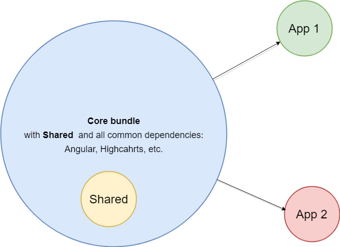

# CoreBundle

## The main idea

The main idea is to put all common libraries such as: Angular, highcharts, moment, etc.
to one bundle and distribute it via npm/artifactory for all Eagle apps



### Disadvantages:

* problems with tree shaking. After building "core-bundle" will contain source 
code of all libraries included to "core-bundle"
* the version of code compiler in apps should be the same as in "core-bundle"
* Extra complexity: Custom syntax for including for common dependencies maks code different from official
  documentation samples
 
Extra complexity for example in [**"main.ts"**](https://github.com/Investigations-eagle/app-with-core-bundle/blob/master/src/main.ts)  
```javascript
import core from './core-bundle-adapter';

import { AppModule } from './app/app.module';
import { environment } from './environments/environment';

if (environment.production) {
  core._enableProdMode();
}

core._platformBrowserDynamic().bootstrapModule(AppModule)
  .catch(err => console.log(err));
```

Extra complexity for example in  [**core-bundle-adapter.ts**](https://github.com/Investigations-eagle/app-with-core-bundle/blob/master/src/core-bundle-adapter/index.ts)
```javascript
import { ng } from 'core-bundle';

// Needed direct use without es6 "destructuring". "Destructuring" causes build error
const core = {
  _enableProdMode: ng.core.enableProdMode,
  _BrowserModule: ng.platformBrowser.BrowserModule,
  _NgModule: ng.core.NgModule,
  _platformBrowserDynamic: ng.platformBrowserDynamic.platformBrowserDynamic,
  _Component: ng.core.Component
};

export default core;
```

### Advantages:

**I don't see any advantages of this approach**

## To start project

```
npm install
npm start
```

## To publish project to npm

```
npm run publish-custom
```
**Note:** This will published all from "dist" dir
